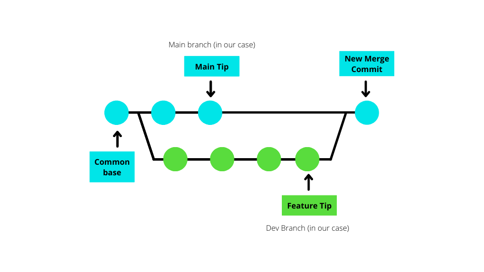
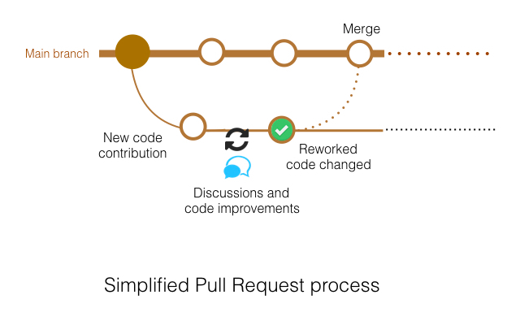

# Git & GitHub

### What is Git?

Git is free and open source version control system. It is used to track changes in the code and supports collaboration.

### What is GitHub?

GitHub is a git repository hosting service, used for story, tracking and collaborating on projects.

### Difference between Git and GitHub?

Git is version control system used to manage multiple versions of code in a repository, whereas, GitHub is a location for uploading copies of your Git repositories.

### Benefits of Version Control

### Main Git Commands

- git init: Create an empty Git repository or reinitialise an existing one.
- git add: Add files to a repository.
- git commit: Commit changes to a repository.
- git push: Pushes the local copy to the server.
- git branch: Separate version of main repo. Can create, delete or list branches in repo.
- git merge: Integrate changes from another branch.
- git pull: Pulls the server copy to the local machine.

### What are branches?

A branch in Git is a way to keep developing and coding a new feature or modification to the software and not affect the main part of the project.

### What is merging?

Git merging is used to integrate changes from another branch.

### What is a Pull Request?

A pull request is to let your team know that you have made changed and pushed to a branch in a repository. Someone can then review the changes and merge into the main branch.

# Git Commands

- `mkdir` Make new folder.

- `cd <folder name>` Change directory to folder.
- `cd ..` Go back one folder.
- `ls` Shows list.
- `ls -a` Shows hidden files and more detailed list.
- `git ls-files` Check to see if any files containing sensitive info are in repo.
- `git init` Initialize an empty repository or reinitialize an existing one.
- `.gitignore` Exclude files from version control in Git
- `git remote add origin <url>` Set connection to GitHub
- `git remote -v` Confirm the remote.
- `git remote rm <remote-name>` Remove remote.
- `git status` Show how things stand currently.
- `git add <file name>` Add file to repo.
- `git add .` Add all files to repo.
- `git commit -m “”` Commit file and add message.
- `git log` Show order of commits. Everything that’s happened.
- `git revert` Revert back to old commit.
- `git diff` Tells the difference between the working directory and repo.
- `git pull` Pulls the server copy to the local machine.
- `git push` Pushes the local copy to the server.
- `git push origin main` Push changes to GitHub.
- `git clone <url>` Clones the repo. Copies all files.

## Generate SSH Key

1. Open your terminal window.

2. Change directory into your .ssh folder.
3. Generate a new key using the command below `ssh-keygen -t rsa -b 4096 -C <email address>`
4. Name the key to your preference for example `samuel-github-key`
5. Use the command `ls` to check your ssh key was created.
6. Open your public ssh key with the command `sudo cat <key-name>.pub`